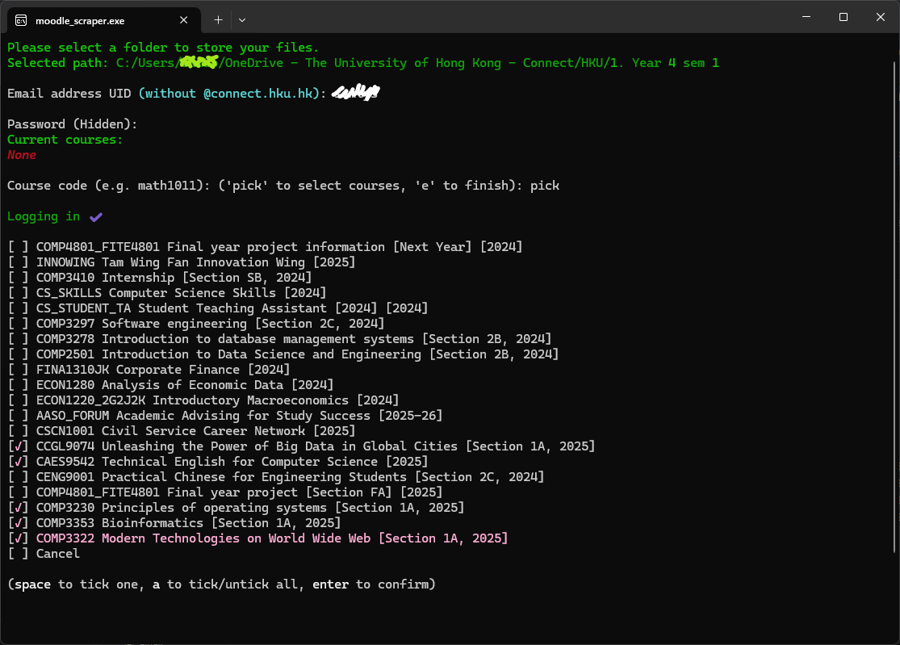
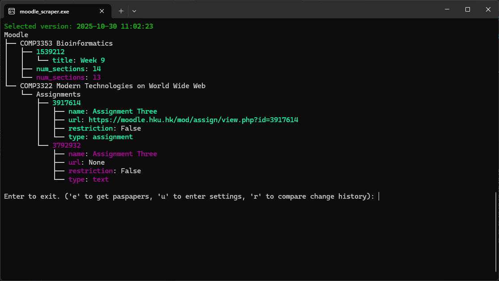
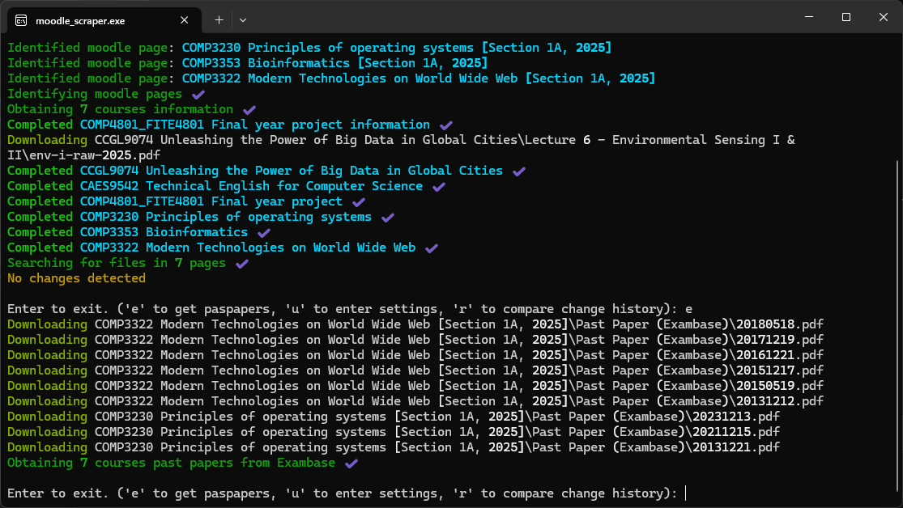

# HKU Moodle Scraper

A cross-platform desktop application for scraping and downloading files from HKU Moodle.

## Functionalities

1.  **Customization Path**: Program files are stored in the same directory as the executable file.
2.  **Secure Password Storage**: Passwords are stored locally and encoded.
3.  **User Menu**: An interactive menu is available upon execution.
4.  **Course Selection**: Users can selectively or manually choose courses during the first execution.
    
5.  **Automatic Folder Structure**: Maintains a local folder structure that mirrors Moodle.
6.  **File Scraping and Downloading**: Scraps and downloads all new files from Moodle to a selected local path.
7.  **Change Log**: Stores a log for every effective execution where updates are found in Moodle.
8.  **Tree-like Comparison**: Provides a tree-like comparison with the latest log file. Green color indicates new additions, while red color indicates removals.
    
9.  **Version Comparison**: Option to compare with other versions after execution.
10. **Settings Update**: Allows users to update settings (login info, courses, paths, etc.) after each execution.
11. **Exambase Scraping**: Option to scrap Exambase after each execution.
    
12. **Cross-Platform Compatibility**: Compatible with both macOS and Windows.

## How to use

1.  Go to the project's "Actions" tab on GitHub and select the latest run.
2.  Download the `macos-latest-executable` or `windows-latest-executable` artifact, depending on your operating system.
3.  Unzip the file and place the executable where you want the program files to be stored.
4.  All set! Feel free to create a shortcut to the executable for easier access!

## Limitations

-   **File checking is based on filename:**
    -   Renaming downloaded files will cause the same file to be re-downloaded on the next run.
    -   Updates will not be reflected if a new file version is uploaded to Moodle without changing the filename.
    -   Multiple copies of a file will be created if the professor renames the file multiple times (one copy for each new filename version).
-   **Folder structure is constrained to match the Moodle page:**
    -   Users should NOT manually change the folder structure, as this will lead to duplicate files and folders being created on the next run.
